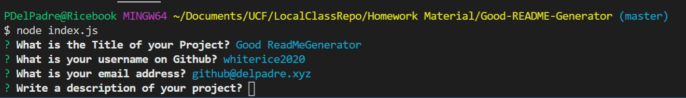

  # Good-README-Generator

  

  # Description
  This project automates the creation of a ReadMe file for projects on GitHub.  It will create required formatting for an industry standard ReadMe.md file.

  #Table of Contents
  * [Installation](#installation)
  * [TableOfContents](#tableOfContents)
  * [Installation](#installation)
  * [Usage](#usage)
  * [License](#license)
  * [Tests](#tests)
  * [Questions](#questions)
  
  # Installation

  You must have node installed. 
  
  1: In terminal, run the following command  

  2: npm i  
  
  3: This will install all dependancies 
  
  
  # Usage

  A Developer will use this to automate the creation of their ReadMe file.  
  
  This will setup formatting, layout, Table of Contents with working links to the section of the page, Licensing Badges, a link to their GitHub page and also their email address for additional questions.

  
  # Videos and Images
  
  
 

  # License

  
  # Tests

  Testing was done with a live GitHub account.

  
  # Questions

  

  [Link to my GitHub](https://github.com/whiterice2020)

  If you have any quesitons, you can email me at github@delpadre.xyz

